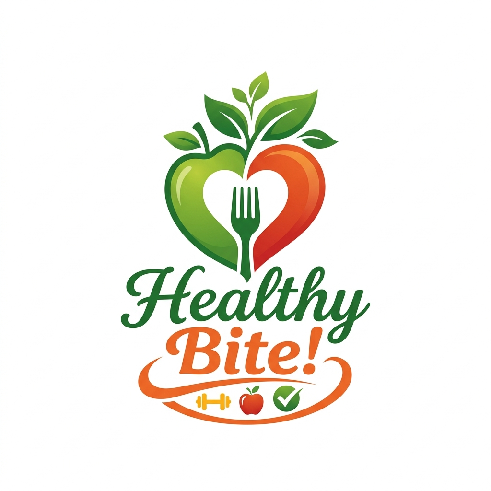

<div align="center">
  
  
  # Healthy Bite 🥗
  
  **Eat Healthy, Live Better.** <br>
  *An AI-powered meal planning, calorie tracking, and nutrition platform.*

  [](https://healthy-bite-7019e.web.app)
</div>

<br>

## 📖 About The Project

**Healthy Bite** is an all-in-one nutrition tracking and meal planning Single Page Application (SPA) built for health-conscious individuals. It allows users to track their daily calorie intake, calculate their BMI, monitor water intake, and discover healthy recipes. 

With the latest integration of **Google's Gemini 2.5 Flash AI**, Healthy Bite now automatically estimates calories and macronutrients for virtually any food item entered, generates custom weekly meal plans, and delivers highly personalized nutrition reports.

The platform features a **freemium model** with advanced AI-powered tools unlocked via a **Stripe Checkout** integration.

## ✨ Features

### 🟢 Free Tier
- **AI Calorie Tracker:** Simply type in any food (e.g., "1 slice of pizza"), and Gemini AI instantly estimates the calories and macros to add to your daily log.
- **Healthy Recipes Database:** Browse breakfast, lunch, and dinner recipes with dietary filters (meat/vegetarian) and allergy exclusions (peanuts, dairy, seafood, etc.).
- **BMI Calculator:** Input height and weight to get instant BMI categorization.
- **Water Intake Calculator:** Calculates daily water needs based on body weight with an animated visualizer.
- **Daily Meal Planner:** Plan your day and earn gamified rewards/badges for completing your meals.

### 👑 Premium Tier
- **Detailed AI Nutrition Analysis:** Get a full macro breakdown (protein, carbs, fat, sugar, sodium, fibre) for any food item using Gemini AI.
- **7-Day Automated Weekly Meal Plan:** Auto-generate a balanced, week-long meal plan with a single click, powered by AI.
- **AI Goal-Based Recommendations:** Tailored meal suggestions depending on your goal (Lose Weight, Gain Muscle, Maintain, Eat Healthier).
- **Advanced AI Nutrition Reports:** The AI analyzes your logged food and macronutrients to provide actionable, personalized suggestions on how to improve your diet. Exportable to TXT, CSV, or PDF.
- **Smart Grocery List:** Instantly compiles a categorized shopping list based on the recipe database.

## 🛠️ Tech Stack

*   **Frontend:** HTML5, CSS3 (Vanilla, custom Design System with Glassmorphism), JavaScript (Vanilla, DOM manipulation, SPA routing).
*   **AI Integration:** Google Gemini API (`gemini-2.5-flash` model for structured JSON generation and dynamic analysis).
*   **Payments:** Stripe Checkout Links.
*   **Backend / BaaS:** Firebase
    *   **Firebase Authentication:** Email & Password signup/login, Google OAuth.
    *   **Cloud Firestore:** Real-time NoSQL database to persist user profiles, food logs (including macros), BMI calculations, and reward points.
    *   **Firebase Hosting:** Global, fast CDN deployment.

## 🚀 How to Run Locally

To run this project locally on your machine:

1. **Clone the repository:**
   ```bash
   git clone https://github.com/MantouOP/Healty-Bite.git
   cd Healty-Bite
   ```

2. **Serve the project:**
   You can use any local web server. For example, using Node.js `serve`:
   ```bash
   npx serve .
   ```
   Or using Python:
   ```bash
   python -m http.server 3000
   ```

3. **Open in Browser:**
   Navigate to `http://localhost:3000`

## 💡 Hackathon Note
This project was rapidly prototyped and built with a focus on modern UI/UX design and practical functionality using a lightweight vanilla stack, paired with Firebase for a robust backend and Gemini AI for dynamic nutrition intelligence.

---
*Built with 💚 for healthier living.*
